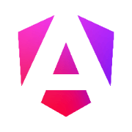

<h1 align="center"> Douglas White App</h1>

[](https://github.com/Apsistec/douglaswhite-app/actions/workflows/deploy.yml)
[](https://github.com/Apsistec/douglaswhite-app/actions/workflows/codeql-analysis.yml)

[![Contributors][contributors-shield]][contributors-url]
[![Forks][forks-shield]][forks-url]
[![Stargazers][stars-shield]][stars-url]
[![Issues][issues-shield]][issues-url]
[![GNU General Public License v3.0][license-shield]][license-url]
[![LinkedIn][linkedin-shield]][linkedin-url]

<p align="center">

</p>
<p align="left"><b>What is DouglasWhite.app?</b></p>
<p>A PWA which provides a look at Douglas White's engineering projects, tech stack,
 skills, background information, and a means to reach him directly.</p>

[Commit Activity][ca]

[Douglas White App on Github](https://github.com/apsistec/douglaswhite=app)

[Explore the docs](https://github.com/apsistec/expert-fit")

[View Demo](https://github.com/apsistec/expert-fit)

[Report Bug](https://github.com/apsistec/expert-fit/issues)

[Request Feature](https://github.com/apsistec/expert-fit/issues)

## Table of Contents

- [Tech Stack](#tech-stack)
- [About The Project](#about-the-project)
- [Table of Contents](#table-of-contents)
- [Installation](#installation)
- [Contributing](#contributing)
- [Contributors/People](#contributorspeople)
- [Support](#support)

## Tech Stack

- [Ionic](https://ionicframework.com)
- [Angular](https://angular.io)
- [Firebase](https://firebase.com)
- [Sendgrid](https://sendgrid.com)

---

## About The Project

[!][screenshot]

The goal has been simple, to provide hiring managers with a portfolio offering
 a quick and accurate view of my engineering background and skills.

## Getting Started

To get a local copy up and running follow these simple example steps.

### Prerequisites

    1. Install
      [NodeJS](https://www.nodejs.com)

    2. Using npm, install:

      ```sh
      npm install npm@latest -global
      ```

      ```sh
      npm install @angular/cli@latest -global
      ```

      ```sh
      npm install @ionic/cli@latest -global
      ```

      ```sh
      npm install firebase-tools@latest -global
      ```

### Acquire Accounts

    1. Get a free Stripe Account at [https://dashboard.stripe.com/apikeys](https://dashboard.stripe.com/apikeys)
    2. Get a free Firebase Account at [https://firebase.com](https://firebase.com)
    3. Get a free Sendgrid Account at [https://app.sendgrid.com](https://app.sendgrid.com)

## Installation

<details open>
<summary>Installation Steps:</summary>
<ol>
    <li>Clone the repo

    ```sh
    git clone https://github.com/apsistec/expert-fit.git
    ```

      </li>
      <li> Install NPM packages

    ```sh
    npm install
    ```

    </li>

    <li>Setup Firebase backend

    ```sh
    firebase init
    ```
    </li>
    <li>Enter your APIs in `environments/environment.ts` and `environments/environment.prod.ts`

    ```js
    export const environment = {
      production: "boolean",
      firebaseConfig: {
        apiKey: "...",
        authDomain: "...",
        databaseURL: "...",
        projectId: "...",
        storageBucket: "...",
        messagingSenderId: "...",
        appId: "...",
        measurementId: "...",
      },
      stripePubKey: "pk_test_ API",
      taxRates: ["enter API"],
    };
    ```
    </li>

    <li>Compile the function code

    ```sh
    cd functions
    ```

    ```sh
    npm install
    ```

    ```sh
    ng build
    ```

    ```sh
    cd -
    ```

    </li>

    <li>Compile the app code -production quality

    ```sh
    ionic build --prod
    ```

    </li>

    <li>Work on the app code with hot-reload

    ```sh
    ionic serve
    ```

    </li>

    <li>Deploy to Firebase Authentication, Hosting, Database, Serverless and Storage

    ```sh
    firebase deploy
    ```

    </li>

</ol>
</details>

## Contributing

    > To get started...

    **Step 1** Install Repo

    * [ ] **Option :one:**

    :trident: Fork this repo:

      ```http
    https://github.com/apsistec/douglaswhite-app
    ```

    * [ ] **Option :two:**

    Clone this repo to your local machine:

      ```shell
    git clone https://github.com/apsistec/douglaswhite-app.git
    ```

    **Step 2** Code your Code

    * [ ] **Option :one:**

    Add previously approved **new code**

    ``` js
      baz = foo(bar) * foo(bar)
      betterBaz = foo(bar^2)
    ```

    -or-

    * [ ] **Option :two:**

    :mag:Find then :wrench:work on the previously approved **changes** and/or
     **refactoring code**

    ``` js
      newFoo(bar2)
      fooBar(newBaz)
    ```

    **Step 3** Pull Request

    * [ ] 🔃 **Create a Pull Request at**

    ```http
    https://github.com/Apsistec/douglaswhite-app/pulls
    ```

    **Step 4** Submit for Review and Acceptance

    * [ ] **Submit!** :beer:

## Contributors/People


### Support

> Reach me at any of the following :link:sites:

- [Douglas White App Contact Info](https://DouglasWhite.app)
- [Twitter Channel](https://twitter.com/rankfsports)
- [Slack Channnel](https://apsistec.slack.com)

Copyright 2021 © [douglaswhiteapp](https://DouglasWhite.app)

[contributors-shield]: https://img.shields.io/github/contributors/apsistec/douglaswhite-app.svg?style=for-the-badge
[contributors-url]: https://github.com/apsistec/douglaswhite-app/graphs/contributors
[forks-shield]: https://img.shields.io/github/forks/apsistec/douglaswhite-app.svg?style=for-the-badge
[forks-url]: https://github.com/apsistec/douglaswhite-app/network/members
[stars-shield]: https://img.shields.io/github/stars/apsistec/douglaswhite-app.svg?style=for-the-badge
[stars-url]: https://github.com/apsistec/douglaswhite-app/stargazers
[issues-shield]: https://img.shields.io/github/issues/apsistec/douglaswhite-app.svg?style=for-the-badge
[issues-url]: https://github.com/apsistec/douglaswhite-app/issues
[license-shield]: https://img.shields.io/github/license/apsistec/douglaswhite-app.svg?style=for-the-badge
[license-url]: https://github.com/apsistec/douglaswhite-app/blob/master/LICENSE.txt
[linkedin-shield]: https://img.shields.io/badge/-LinkedIn-black.svg?style=for-the-badge&logo=linkedin&colorB=555
[linkedin-url]: https://linkedin.com/in/apsistec
[ca]: https://github.com/Apsistec/douglaswhite-app/graphs/commit-activity
[screenshot]: ./src/assets/logo.svg
